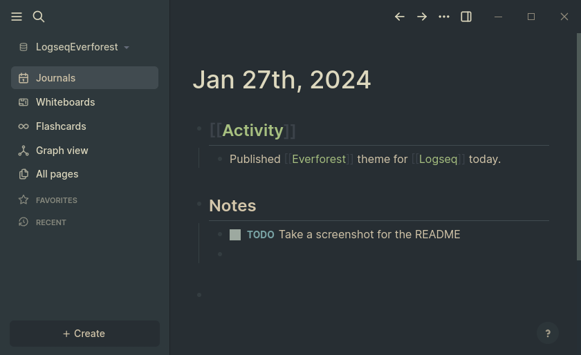

# Everforest Theme for Logseq

Theme for [Logseq](https://logseq.com/) based on the [Everforest](https://github.com/sainnhe/everforest) colour scheme.

The settings code is based on code from the [Catppuccin](https://github.com/catppuccin/logseq) Logseq theme.

## Installation

1. Install from the Logseq Plugin Marketplace (pending)
2. Download or clone this repository to your Logseq plugins directory. Restart Logseq if it was running.
3. Download or clone this repository to somewhere on your filesytem. Enable developer mode and then use `Load unpacked plugin` under `Plugins` to install it.

## Variations

The plugin includes all of the light/dark/hard/medium/soft variations of the Everforest colour scheme. Select between light and dark under `Settings` > `Theme`, and select between hard, medium and soft under `Themes` in the app menu.

## Accent Colours

Under `Settings` > `Plugins` > `Everforest` you can select one of the foreground colours of the scheme as an accent colour. This will be used for links and the sidebar text. The default uses green for the links and the main foreground colour for the sidebar.

